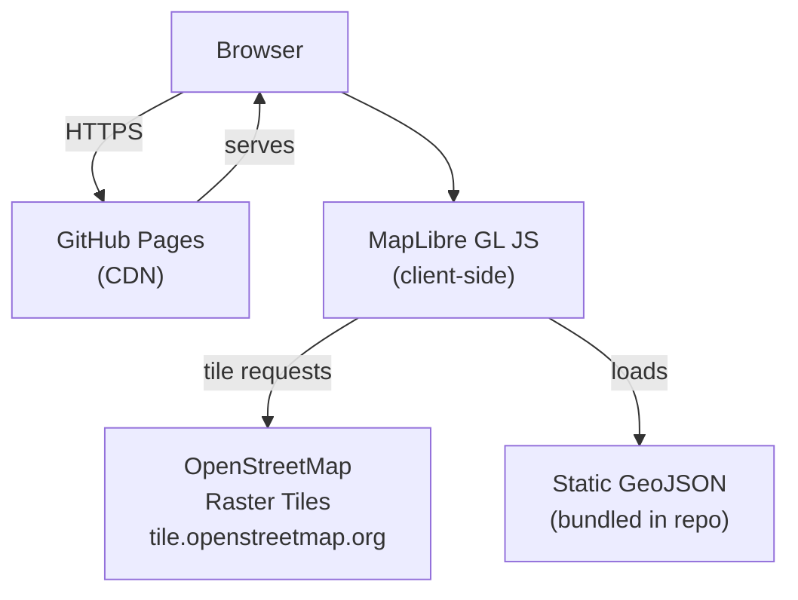
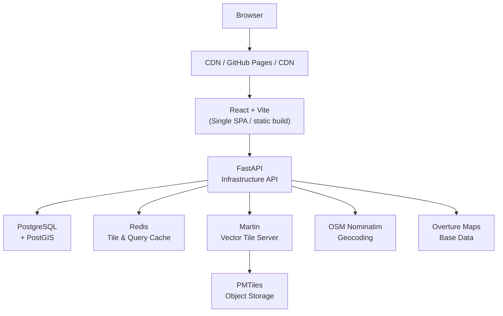
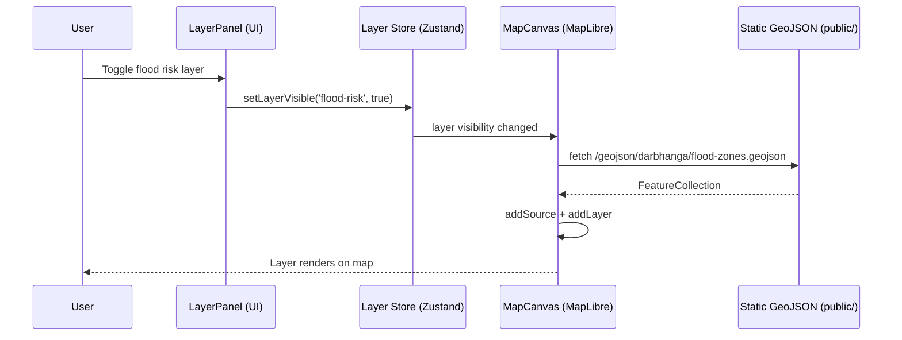
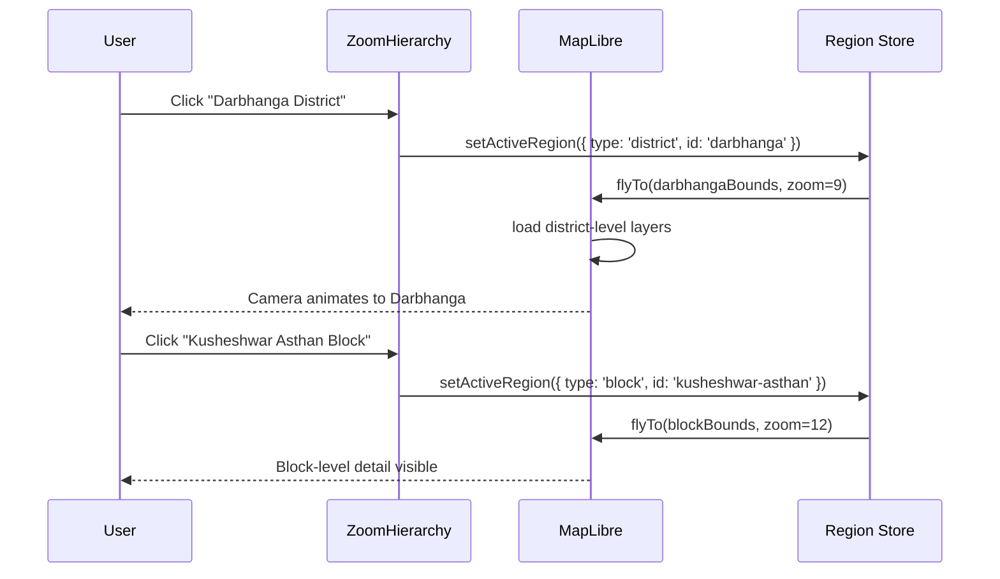

# Architecture Spec

## Overview

Better Bharat Map is designed as a **progressive architecture** — starting fully static (Phase 1–2) and evolving into a server-backed intelligence platform (Phase 3+) without requiring a full rewrite. Every architectural decision in Phase 1 must be forward-compatible with Phase 3.

---

## Deployment Topology

### Phase 1–2: Static (GitHub Pages)



### Phase 3+: Server-Backed



---

## Application Architecture

### Directory Structure (Phase 1)

```
better-bharat-map/
├── spec/                        ← this spec suite
├── public/
│   ├── geojson/
│   │   ├── darbhanga/
│   │   │   ├── district-boundary.geojson
│   │   │   ├── blocks.geojson
│   │   │   ├── panchayats.geojson
│   │   │   ├── villages.geojson
│   │   │   ├── roads.geojson
│   │   │   ├── rivers.geojson
│   │   │   ├── flood-zones.geojson
│   │   │   ├── healthcare.geojson
│   │   │   ├── schools.geojson
│   │   │   └── electricity-grid.geojson
│   │   └── india/
│   │       ├── states.geojson
│   │       └── districts.geojson
│   └── fonts/
├── src/
│   ├── app/
│   │   ├── layout.tsx           ← root layout, hosts global MapCanvas client provider
│   │   ├── page.tsx             ← homepage / landing
│   │   ├── map/
│   │   │   └── page.tsx         ← shallow path/state overlay for full-screen map view
│   │   ├── about/
│   │   │   └── page.tsx
│   │   └── globals.css
│   ├── components/
│   │   ├── map/
│   │   │   ├── MapCanvas.tsx    ← MapLibre mount point
│   │   │   ├── MapControls.tsx  ← zoom, compass, fullscreen
│   │   │   ├── LayerToggle.tsx  ← infrastructure layer switcher
│   │   │   ├── ZoomHierarchy.tsx ← Earth→Village nav
│   │   │   └── Popup.tsx        ← feature detail popup
│   │   ├── panels/
│   │   │   ├── IntelligencePanel.tsx
│   │   │   ├── LayerPanel.tsx
│   │   │   └── StatsPanel.tsx
│   │   ├── ui/                  ← shadcn components
│   │   └── layout/
│   │       ├── Header.tsx
│   │       ├── Sidebar.tsx
│   │       └── Footer.tsx
│   ├── data/
│   │   ├── layers.ts            ← layer registry
│   │   ├── regions.ts           ← region hierarchy definitions
│   │   └── map-config.ts        ← MapLibre style, initial viewport
│   ├── hooks/
│   │   ├── useMap.ts            ← MapLibre instance ref
│   │   ├── useLayer.ts          ← layer visibility state
│   │   └── useRegion.ts         ← active region state
│   ├── lib/
│   │   ├── geo.ts               ← GeoJSON utilities
│   │   └── format.ts            ← number/label formatting
│   └── types/
│       ├── map.ts
│       ├── layer.ts
│       └── region.ts
├── vite.config.js
├── tailwind.config.ts
└── components.json              ← shadcn config
```

---

## Data Flow

### Layer Rendering Pipeline



### Earth → Village Navigation Flow



---

## State Management

Phase 1 uses **Zustand** (lightweight, no provider boilerplate, SSR-safe for static export).

### Stores

| Store            | Responsibility                                                 |
| ---------------- | -------------------------------------------------------------- |
| `useMapStore`    | MapLibre instance ref, viewport state (center, zoom, bearing)  |
| `useLayerStore`  | Layer visibility, active layer category, layer opacity         |
| `useRegionStore` | Active region hierarchy (state → district → block → village)   |
| `useUIStore`     | Panel open/close states, mobile drawer, selected feature popup, and `canvasMode` (`'landing' | 'dashboard'`) triggers for fade transitions |

---

## Static Vite Build (Phase 1)

This project builds as a static Single-Page React application using Vite. Deploy static assets to GitHub Pages, Netlify, or Cloudflare Pages.

Sample `package.json` scripts:

```json
{
  "scripts": {
    "dev": "vite",
    "build": "vite build",
    "preview": "vite preview"
  }
}
```

### Constraints for Static SPA

| Feature              | Status                       | Workaround / Notes                   |
| -------------------- | ---------------------------- | ------------------------------------ |
| API Routes           | ❌ Not part of SPA           | Use external API (FastAPI / Node)    |
| Server-only helpers  | ❌ Not available in build    | Move logic to backend or build step  |
| Image optimization   | ✅ Handled by build/hosting   | Use plain `` or optimized assets|
| Client Components    | ✅ Full support              | Map, panels, interactivity           |

### Modulith note

The repo is a modulith: a single repository containing multiple well-scoped modules (UI, map-engine, data, services). Modules communicate via clear JS/JSON contracts and shared libraries, while remaining deployable as one static site in Phase 1 and upgradeable to a server-backed system in Phase 3.

---

## Performance Strategy (Phase 1)

| Concern              | Strategy                                                         |
| -------------------- | ---------------------------------------------------------------- |
| GeoJSON file size    | Split by region; lazy-load on zoom level                         |
| Map tile performance | Use OSM raster tiles (free); switch to vector PMTiles in Phase 3 |
| Bundle size          | Dynamic import MapLibre GL JS (heavy, ~600KB gzipped)            |
| First paint          | Map Canvas is mounted globally in root layout. MapLibre engine initializes on client side with a silent skeleton background while homepage static hero elements are immediately interactive. |
| Layer data           | Fetch GeoJSON only when layer is toggled on                      |

---

## Security Considerations (Phase 1)

Since Phase 1 is fully static, attack surface is minimal:

- No API keys in frontend (OSM tiles are keyless)
- No user data collected
- No authentication required
-- CSP headers configured via hosting configuration or static `_headers` / `_redirects` files (for GitHub Pages, Netlify, Cloudflare Pages). Add CSP meta tags in the generated `index.html` if necessary.

---

## Forward Compatibility Principles

Every Phase 1 decision must support Phase 3 migration:

1. **GeoJSON data contracts** must match future PostGIS query output shapes
2. **Layer IDs** (`flood-risk`, `road-quality`, etc.) must be stable — they become API endpoints
3. **Region hierarchy** types must match future DB `region_type` enum
4. **Zustand stores** must be replaceable with SWR/React Query when API is live
5. **Component interfaces** must not assume static data — accept data as props
