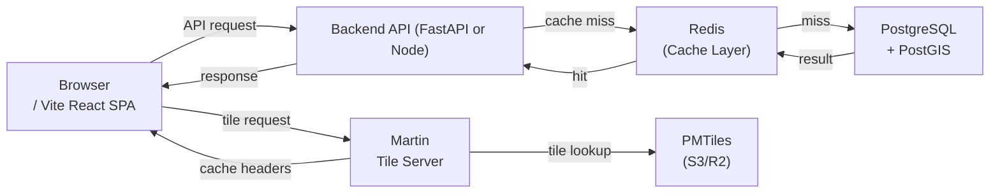
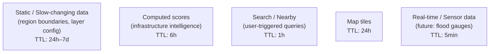
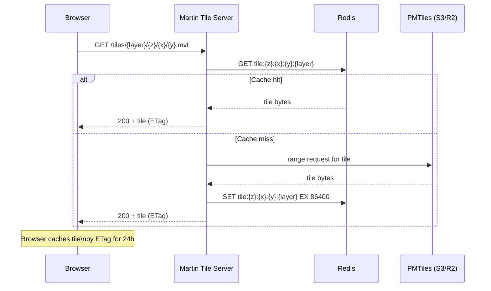

# Caching Spec

---

## Phase 1–2: Static Caching (No Redis)

In the static export phase, caching is handled entirely by the browser and GitHub Pages CDN.

### Browser Cache Strategy

| Resource        | Cache-Control                 | Notes                                 |
| --------------- | ----------------------------- | ------------------------------------- |
| `index.html`    | `no-cache`                    | Always revalidate HTML                |
| JS/CSS chunks   | `max-age=31536000, immutable` | Vite content-hashed filenames        |
| GeoJSON files   | `max-age=86400`               | 1 day; change via filename versioning |
| Map tile images | `max-age=86400`               | OSM tiles cached by browser           |
| Fonts           | `max-age=31536000, immutable` |                                       |

### GeoJSON Lazy Loading Pattern

GeoJSON files are **not bundled** into the JS build. They live in `public/geojson/` and are fetched at runtime when a layer is first enabled.

```typescript
// hooks/useLayerData.ts
const cache = new Map<string, FeatureCollection>();

async function fetchLayer(layerId: string): Promise<FeatureCollection> {
  if (cache.has(layerId)) return cache.get(layerId)!;

  const res = await fetch(`${basePath}/geojson/darbhanga/${layerId}.geojson`);
  const data = await res.json();
  cache.set(layerId, data);
  return data;
}
```

This in-memory cache persists for the browser session — re-toggling a layer does not re-fetch.

---

## Phase 3+: Redis Caching

### Cache Architecture



### Redis Key Patterns

All keys follow `{namespace}:{resource}:{identifier}` convention.

| Key Pattern                                       | TTL | Description                              |
| ------------------------------------------------- | --- | ---------------------------------------- |
| `region:slug:{slug}`                              | 24h | Region record by slug                    |
| `region:children:{id}`                            | 24h | Child regions list                       |
| `score:{region_id}:{category}`                    | 6h  | Infrastructure score for region+category |
| `score:all:{region_id}`                           | 6h  | All category scores for a region         |
| `features:{layer_id}:{region_id}`                 | 6h  | Features by layer in region              |
| `features:nearby:{layer}:{lat}:{lon}:{radius_km}` | 1h  | Nearby feature search                    |
| `tile:{z}:{x}:{y}:{layer_id}`                     | 24h | Vector tile bytes                        |
| `geocode:{query_hash}`                            | 7d  | Geocoding result (slow-changing)         |
| `import:status:{import_id}`                       | 1h  | Import job status                        |
| `scenario:outcomes:{scenario_id}`                 | 30d | Simulation results                       |

### TTL Policy



### Cache Invalidation Strategy

| Trigger                   | Invalidation                                                           |
| ------------------------- | ---------------------------------------------------------------------- |
| New data import completes | Delete all `score:*:{region_id}` and `features:{layer_id}:{region_id}` |
| Admin manual flush        | Delete by key prefix pattern                                           |
| Deployment                | No automatic flush; stale TTLs expire naturally                        |
| Score recomputation       | Delete `score:{region_id}:{category}`                                  |
| Tile data update          | Delete `tile:*:*:*:{layer_id}` via scan                                |

```bash
# Invalidate all scores for a region
redis-cli DEL "score:all:{region_id}"
redis-cli --scan --pattern "score:{region_id}:*" | xargs redis-cli DEL

# Invalidate all tiles for a layer
redis-cli --scan --pattern "tile:*:*:*:{layer_id}" | xargs redis-cli DEL
```

### Cache Configuration

```yaml
# Redis config (redis.conf or upstash settings)
maxmemory: 512mb
maxmemory-policy: allkeys-lru # evict least recently used when memory full
save: "" # no persistence — cache is pure cache
```

### Cache-Aside Pattern (FastAPI)

```python
async def get_region_scores(region_id: str) -> list[InfrastructureScore]:
    cache_key = f"score:all:{region_id}"

    # Try cache first
    cached = await redis.get(cache_key)
    if cached:
        return [InfrastructureScore(**s) for s in json.loads(cached)]

    # Cache miss — query DB
    scores = await db.fetch_scores(region_id)

    # Populate cache
    await redis.setex(cache_key, 21600, json.dumps([s.dict() for s in scores]))

    return scores
```

---

## Tile Caching Strategy

### Phase 2 (Static): OSM Raster Tiles

Served by OpenStreetMap CDN. No caching control on our side.

### Phase 3: PMTiles + Martin



### PMTiles Benefits

- Single `.pmtiles` file per layer per region → no per-tile DB queries
- Efficient range requests — browser only downloads visible tiles
- Can be hosted on S3, Cloudflare R2, or GitHub Releases (for small files in Phase 2)
- MapLibre GL JS has native PMTiles support via `pmtiles://` protocol
