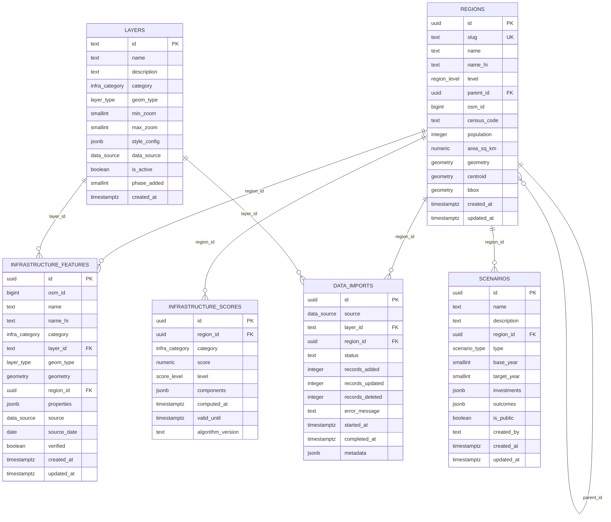
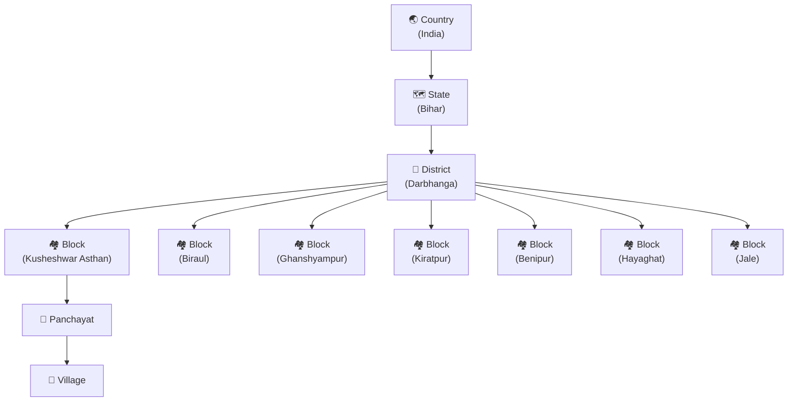
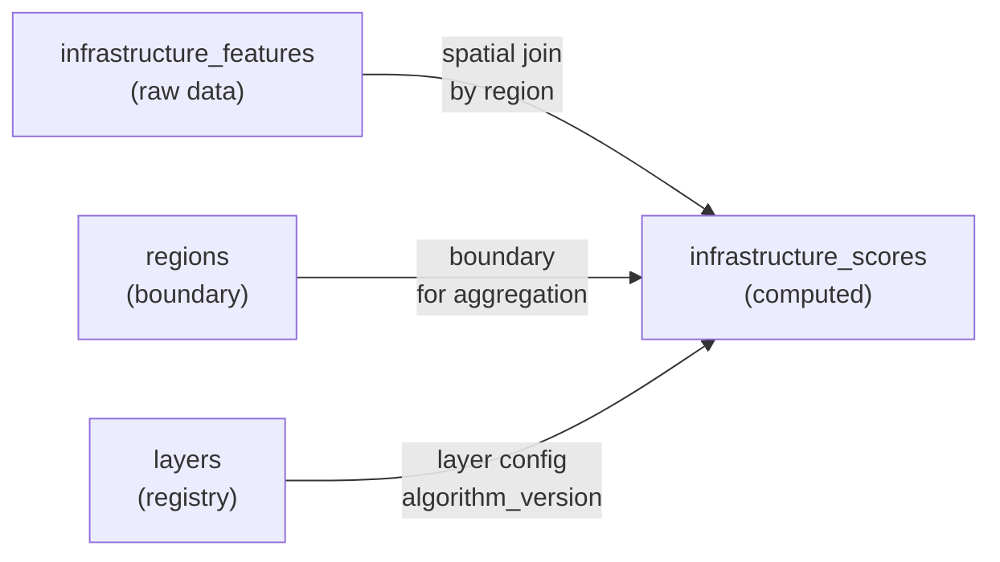
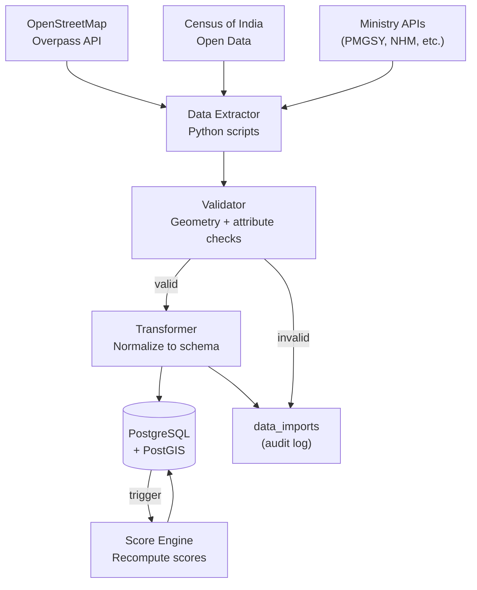
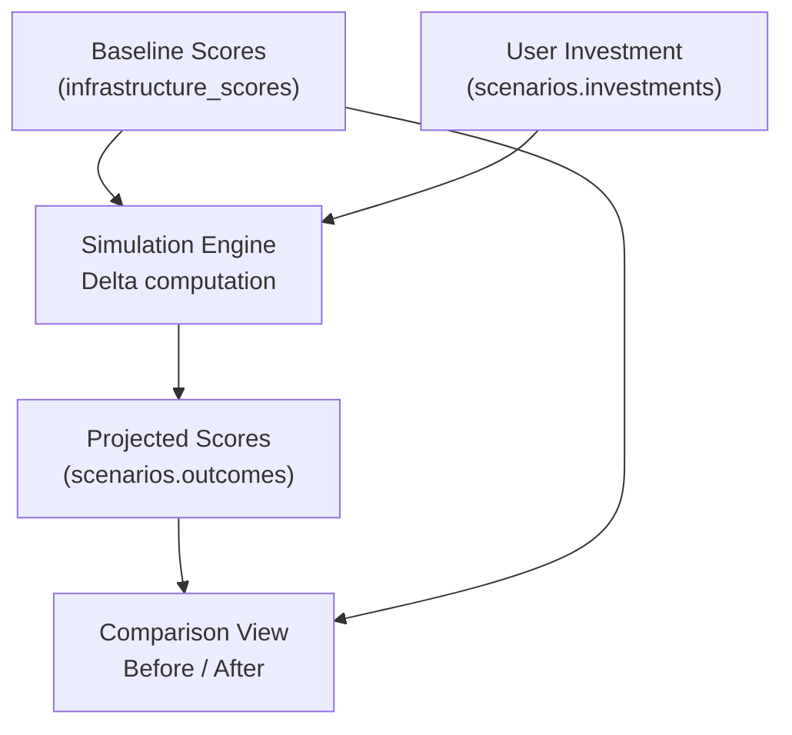

# Database ERD

## Entity Relationship Diagram

```mermaid
erDiagram
    REGIONS {
        uuid id PK
        text slug UK
        text name
        text name_hi
        region_level level
        uuid parent_id FK
        bigint osm_id
        text census_code
        integer population
        numeric area_sq_km
        geometry geometry
        geometry centroid
        geometry bbox
        timestamptz created_at
        timestamptz updated_at
    }

    INFRASTRUCTURE_FEATURES {
        uuid id PK
        bigint osm_id
        text name
        text name_hi
        infra_category category
        text layer_id FK
        layer_type geom_type
        geometry geometry
        uuid region_id FK
        jsonb properties
        data_source source
        date source_date
        boolean verified
        timestamptz created_at
        timestamptz updated_at
    }

    INFRASTRUCTURE_SCORES {
        uuid id PK
        uuid region_id FK
        infra_category category
        numeric score
        score_level level
        jsonb components
        timestamptz computed_at
        timestamptz valid_until
        text algorithm_version
    }

    LAYERS {
        text id PK
        text name
        text description
        infra_category category
        layer_type geom_type
        smallint min_zoom
        smallint max_zoom
        jsonb style_config
        data_source data_source
        boolean is_active
        smallint phase_added
        timestamptz created_at
    }

    DATA_IMPORTS {
        uuid id PK
        data_source source
        text layer_id FK
        uuid region_id FK
        text status
        integer records_added
        integer records_updated
        integer records_deleted
        text error_message
        timestamptz started_at
        timestamptz completed_at
        jsonb metadata
    }

    SCENARIOS {
        uuid id PK
        text name
        text description
        uuid region_id FK
        scenario_type type
        smallint base_year
        smallint target_year
        jsonb investments
        jsonb outcomes
        boolean is_public
        text created_by
        timestamptz created_at
        timestamptz updated_at
    }

    REGIONS ||--o{ REGIONS : "parent_id"
    REGIONS ||--o{ INFRASTRUCTURE_FEATURES : "region_id"
    REGIONS ||--o{ INFRASTRUCTURE_SCORES : "region_id"
    REGIONS ||--o{ DATA_IMPORTS : "region_id"
    REGIONS ||--o{ SCENARIOS : "region_id"
    LAYERS ||--o{ INFRASTRUCTURE_FEATURES : "layer_id"
    LAYERS ||--o{ DATA_IMPORTS : "layer_id"
```

---

## Region Hierarchy Tree

```mermaid
graph TD
    Country["🌏 Country\n(India)"]
    State["🗺️ State\n(Bihar)"]
    District["📍 District\n(Darbhanga)"]
    Block1["🏘️ Block\n(Kusheshwar Asthan)"]
    Block2["🏘️ Block\n(Biraul)"]
    Block3["🏘️ Block\n(Ghanshyampur)"]
    Block4["🏘️ Block\n(Kiratpur)"]
    Block5["🏘️ Block\n(Benipur)"]
    Block6["🏘️ Block\n(Hayaghat)"]
    Block7["🏘️ Block\n(Jale)"]
    Panchayat["🏡 Panchayat"]
    Village["🌾 Village"]

    Country --> State
    State --> District
    District --> Block1
    District --> Block2
    District --> Block3
    District --> Block4
    District --> Block5
    District --> Block6
    District --> Block7
    Block1 --> Panchayat
    Panchayat --> Village
```

---

## Score Computation Dependency

```mermaid
graph LR
    F["infrastructure_features\n(raw data)"]
    R["regions\n(boundary)"]
    SC["infrastructure_scores\n(computed)"]
    L["layers\n(registry)"]

    F -->|"spatial join\nby region"| SC
    R -->|"boundary\nfor aggregation"| SC
    L -->|"layer config\nalgorithm_version"| SC
```

---

## Data Import Pipeline

```mermaid
flowchart TD
    OSM["OpenStreetMap\nOverpass API"]
    Census["Census of India\nOpen Data"]
    Ministry["Ministry APIs\n(PMGSY, NHM, etc.)"]

    Extractor["Data Extractor\nPython scripts"]
    Validator["Validator\nGeometry + attribute checks"]
    Transformer["Transformer\nNormalize to schema"]

    DB[("PostgreSQL\n+ PostGIS")]
    ImportLog["data_imports\n(audit log)"]

    OSM --> Extractor
    Census --> Extractor
    Ministry --> Extractor
    Extractor --> Validator
    Validator -->|valid| Transformer
    Validator -->|invalid| ImportLog
    Transformer --> DB
    Transformer --> ImportLog
    DB -->|trigger| ScoreEngine["Score Engine\nRecompute scores"]
    ScoreEngine --> DB
```

---

## Scenario Simulation Flow (Phase 5)

```mermaid
flowchart TD
    Baseline["Baseline Scores\n(infrastructure_scores)"]
    Investment["User Investment\n(scenarios.investments)"]
    Engine["Simulation Engine\nDelta computation"]
    Projection["Projected Scores\n(scenarios.outcomes)"]
    UI["Comparison View\nBefore / After"]

    Baseline --> Engine
    Investment --> Engine
    Engine --> Projection
    Projection --> UI
    Baseline --> UI
```
