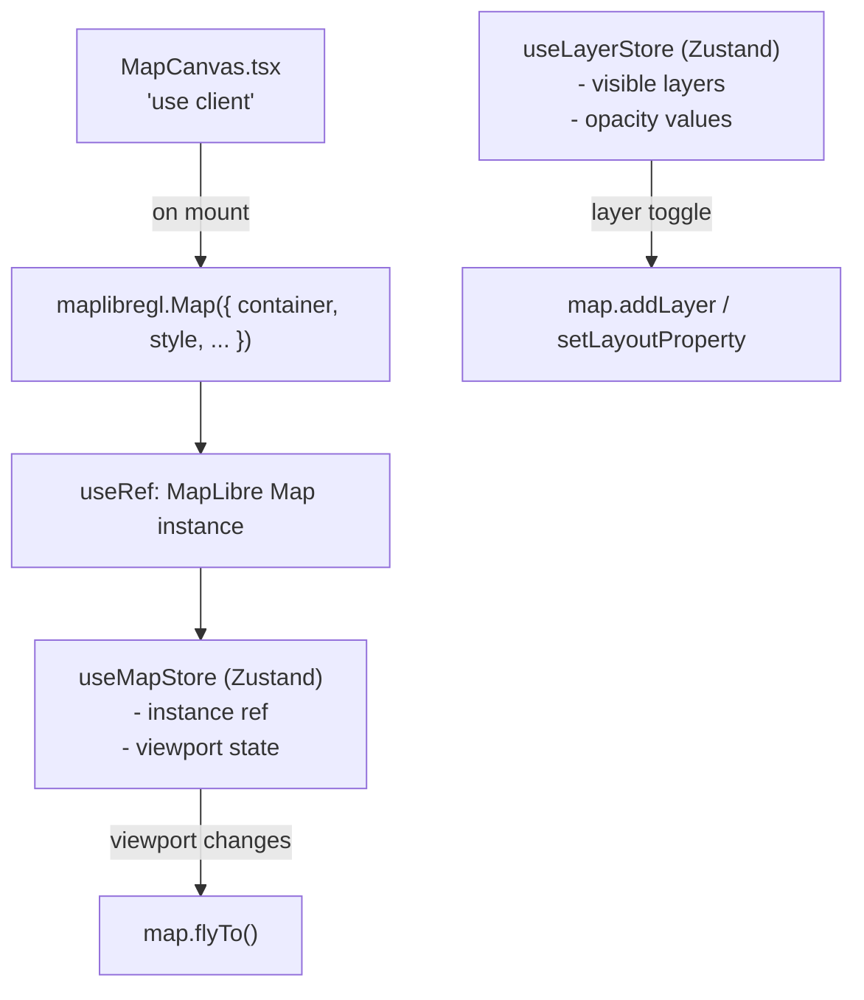
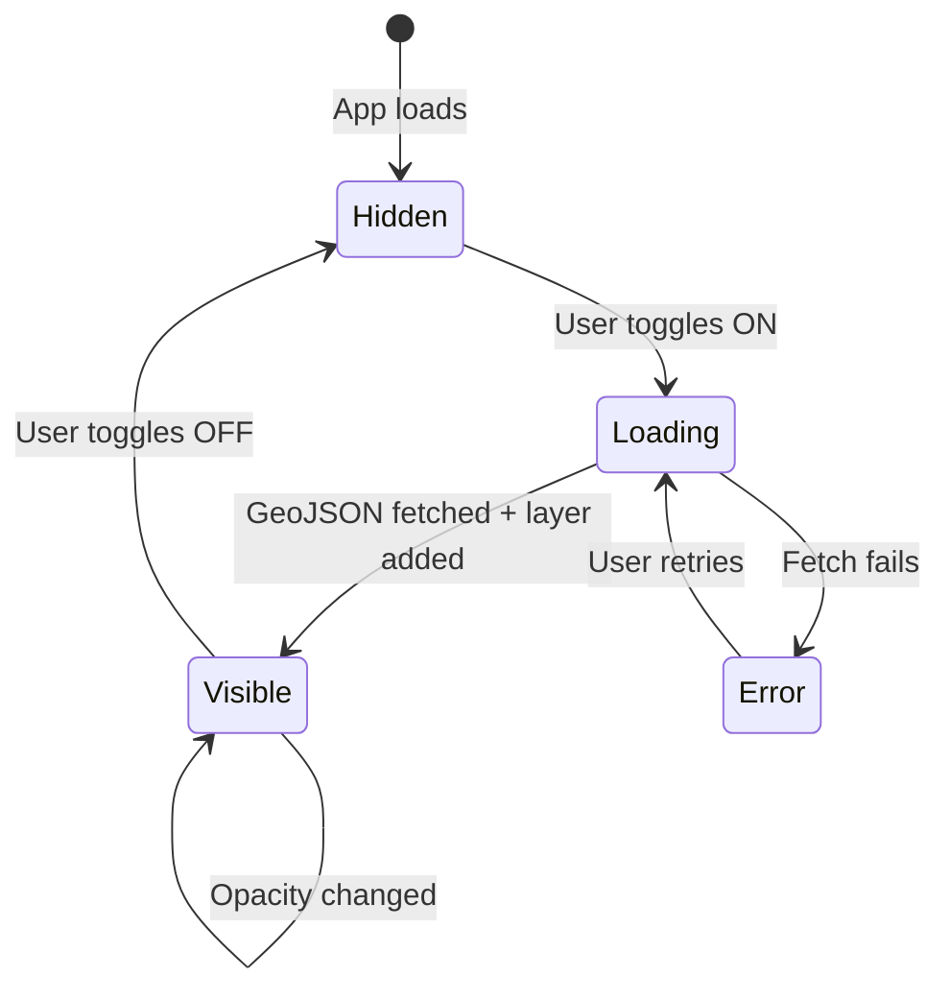

# Map Engine Spec

---

## Library Choice

| Library            | Version                | Purpose                                      |
| ------------------ | ---------------------- | -------------------------------------------- |
| **MapLibre GL JS** | 4.x                    | Core map rendering (open-source Mapbox fork) |
| **react-map-gl**   | 7.x (MapLibre flavour) | React wrapper for MapLibre                   |
| **pmtiles**        | 3.x                    | PMTiles protocol handler (Phase 3+)          |

**Why MapLibre over Mapbox:**

- No API key required for core rendering
- Open source (BSD-2-Clause)
- Active community, Mapbox GL compatible API
- PMTiles support built-in
- No usage-based billing

---

## MapLibre Integration Pattern



### MapCanvas.tsx Structure

```typescript
'use client';
import { useEffect, useRef } from 'react';
import maplibregl from 'maplibre-gl';
import 'maplibre-gl/dist/maplibre-gl.css';
import { useMapStore } from '@/stores/map';
import { useLayerStore } from '@/stores/layer';
import { useTheme } from '@/hooks/useTheme';
import { MAP_STYLES, INITIAL_VIEWPORT } from '@/data/map-config';

export function MapCanvas() {
  const containerRef = useRef<HTMLDivElement>(null);
  const mapRef = useRef<maplibregl.Map | null>(null);
  const { setMap } = useMapStore();
  const { visibleLayers } = useLayerStore();
  const { theme } = useTheme();

  // Mount map
  useEffect(() => {
    if (!containerRef.current || mapRef.current) return;

    const map = new maplibregl.Map({
      container: containerRef.current,
      style: MAP_STYLES[theme === 'dark' ? 'dark' : 'light'],
      center: [INITIAL_VIEWPORT.longitude, INITIAL_VIEWPORT.latitude],
      zoom: INITIAL_VIEWPORT.zoom,
      attributionControl: true,
    });

    map.addControl(new maplibregl.NavigationControl(), 'bottom-right');
    map.addControl(new maplibregl.ScaleControl({ unit: 'metric' }), 'bottom-left');

    map.on('load', () => {
      setMap(map);
      mapRef.current = map;
    });

    return () => {
      map.remove();
      mapRef.current = null;
    };
  }, []);

  // Sync theme → map style
  useEffect(() => {
    if (!mapRef.current) return;
    mapRef.current.setStyle(MAP_STYLES[theme === 'dark' ? 'dark' : 'light']);
  }, [theme]);

  return <div ref={containerRef} className="w-full h-full" />;
}
```

---

## Layer System

### Layer Lifecycle



### Layer Addition Pattern

```typescript
// lib/map/addInfraLayer.ts
export async function addInfraLayer(
  map: maplibregl.Map,
  layerConfig: LayerConfig,
) {
  const { id, geojsonPath, paint, layout, type } = layerConfig;

  // 1. Fetch data
  const res = await fetch(geojsonPath);
  const geojson = await res.json();

  // 2. Add source (idempotent)
  if (!map.getSource(id)) {
    map.addSource(id, { type: "geojson", data: geojson });
  }

  // 3. Add layer (idempotent)
  if (!map.getLayer(id)) {
    map.addLayer({ id, source: id, type, paint, layout });
  }

  // 4. Register popup
  registerPopup(map, id);
}

export function removeInfraLayer(map: maplibregl.Map, layerId: string) {
  if (map.getLayer(layerId)) map.removeLayer(layerId);
  if (map.getSource(layerId)) map.removeSource(layerId);
}
```

### Layer Paint Config Examples

```typescript
// Flood risk zone (polygon)
{
  type: 'fill',
  paint: {
    'fill-color': [
      'interpolate', ['linear'],
      ['get', 'risk_score'],
      0, '#93C5FD',    // low risk: light blue
      50, '#3B82F6',   // moderate: blue
      100, '#1D4ED8',  // high risk: dark blue
    ],
    'fill-opacity': 0.4,
    'fill-outline-color': '#2563EB',
  }
}

// Road quality (linestring)
{
  type: 'line',
  paint: {
    'line-color': [
      'match', ['get', 'surface'],
      'paved',   '#22C55E',
      'gravel',  '#F59E0B',
      'dirt',    '#EF4444',
      '#94A3B8'  // unknown
    ],
    'line-width': [
      'match', ['get', 'road_class'],
      'primary',   4,
      'secondary', 3,
      'tertiary',  2,
      1
    ],
  }
}

// Healthcare facilities (point)
{
  type: 'circle',
  paint: {
    'circle-radius': 6,
    'circle-color': [
      'match', ['get', 'facility_type'],
      'hospital', '#DC2626',
      'PHC',      '#EF4444',
      'sub-centre','#FCA5A5',
      '#94A3B8'
    ],
    'circle-stroke-color': '#FFFFFF',
    'circle-stroke-width': 1.5,
  }
}
```

---

## Popup System

```typescript
// lib/map/registerPopup.ts
export function registerPopup(map: maplibregl.Map, layerId: string) {
  const popup = new maplibregl.Popup({
    closeButton: true,
    closeOnClick: false,
    maxWidth: "320px",
    className: "bbm-popup",
  });

  map.on("click", layerId, (e) => {
    const feature = e.features?.[0];
    if (!feature) return;

    const html = buildPopupHtml(feature);
    popup.setLngLat(e.lngLat).setHTML(html).addTo(map);
  });

  map.on("mouseenter", layerId, () => {
    map.getCanvas().style.cursor = "pointer";
  });

  map.on("mouseleave", layerId, () => {
    map.getCanvas().style.cursor = "";
  });
}
```

---

## Zoom Hierarchy & Camera

### Zoom Level → Data Density Contract

| Zoom  | What loads                             |
| ----- | -------------------------------------- |
| 1–3   | India boundary only                    |
| 4–5   | State boundaries                       |
| 6–8   | District boundaries, major rivers      |
| 9–11  | Block boundaries, district roads       |
| 12–13 | Panchayat boundaries, village roads    |
| 14+   | Village points, all layers full detail |

### Camera Transition

```typescript
// lib/map/flyToRegion.ts
export function flyToRegion(map: maplibregl.Map, region: Region) {
  const targets: Record<RegionLevel, Partial<FlyToOptions>> = {
    country: { zoom: 4, duration: 2000 },
    state: { zoom: 6, duration: 1800 },
    district: { zoom: 9, duration: 1500 },
    block: { zoom: 12, duration: 1200 },
    panchayat: { zoom: 14, duration: 1000 },
    village: { zoom: 16, duration: 800 },
  };

  const opts = targets[region.level];
  map.flyTo({
    center: [region.centroid.lon, region.centroid.lat],
    ...opts,
    essential: true, // ignores prefers-reduced-motion
  });
}
```

### fitBounds Alternative (for irregularly shaped regions)

```typescript
export function fitRegion(map: maplibregl.Map, region: Region) {
  const bounds = new maplibregl.LngLatBounds(
    [region.bbox.west, region.bbox.south],
    [region.bbox.east, region.bbox.north],
  );

  map.fitBounds(bounds, {
    padding: { top: 80, bottom: 80, left: 340, right: 80 }, // 340 = panel width
    maxZoom: 14,
    duration: 1200,
  });
}
```

---

## Performance Optimizations

### 1. Dynamic Import (Critical — MapLibre is 600KB gzipped)

```javascript
// In a Vite React SPA use `React.lazy` + `Suspense` or dynamic import with a fallback
import React, { lazy, Suspense } from 'react';

const MapCanvas = lazy(() => import('@/components/map/MapCanvas'));

// Usage:
// <Suspense fallback={<MapSkeleton />}><MapCanvas /></Suspense>
```

### 2. GeoJSON Simplification for Lower Zooms

For Phase 1, pre-simplify GeoJSON at different tolerance levels:

```
geojson/darbhanga/
├── blocks-z9.geojson     # simplified for zoom 9–11
├── blocks-z12.geojson    # full detail for zoom 12+
```

### 3. Source Clustering for Point Layers

```typescript
map.addSource("healthcare", {
  type: "geojson",
  data: geojson,
  cluster: true,
  clusterMaxZoom: 12, // above zoom 12, show individual points
  clusterRadius: 50,
});
```

### 4. Visibility Rules (not add/remove)

For frequently toggled layers, prefer `setLayoutProperty` over add/remove:

```typescript
map.setLayoutProperty(layerId, "visibility", visible ? "visible" : "none");
```

This avoids re-parsing the GeoJSON source on re-toggle.
