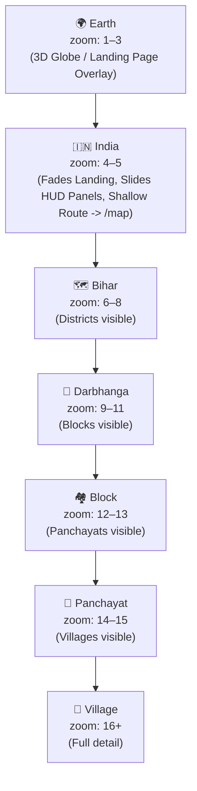

# Navigation Spec

## Earth → Village Zoom Hierarchy



---

## Immersive Seamless Zoom Transition Logic

The platform implements a **Single-Canvas Immersive Navigation** flow. The `MapCanvas` does not unmount when moving between the landing page (`/`) and the full interactive mapping dashboard (`/map`). Instead, the UI dynamically transitions based on the camera's zoom level.

### Zoom Threshold Rules

| Camera Zoom | UI View Mode | Map Projection | Behavior | URL Route |
| :--- | :--- | :--- | :--- | :--- |
| **Zoom < 4** | **Landing Page** | `globe` (3D Earth) | Auto-spin enabled. Landing page overlays (Hero text, explainers) fade into view (opacity = 1). Dashboard HUD panels are hidden. | `/` (Homepage) |
| **Zoom >= 4** | **Mapping Dashboard** | `mercator` / `globe` | Auto-spin disabled. Landing page overlays fade out (opacity = 0). Dashboard HUD panels (layers, stats) slide into place. | `/map` |

### Transition State Invariant

```typescript
// hooks/useMapTransition.ts
import { useEffect } from 'react';
import { useMapStore } from '@/stores/map';

export function useMapTransition() {
  const { map, zoom } = useMapStore();
  // In a Vite React SPA we rely on the History API or a client router.
  const pathname = typeof window !== 'undefined' ? window.location.pathname : '/';

  useEffect(() => {
    if (!map) return;

    if (zoom >= 4 && pathname === '/') {
      // Transition to map dashboard without reloading page
      window.history.pushState({}, '', '/map');
      map.setProjection({ name: 'mercator' });
      // Stop Earth auto-spin
    } else if (zoom < 4 && pathname === '/map') {
      // Transition back to landing homepage
      window.history.pushState({}, '', '/');
      map.setProjection({ name: 'globe' });
      // Re-enable Earth auto-spin
    }
  }, [zoom, pathname, map]);
}
```

## ZoomHierarchy Component Spec

The breadcrumb-style navigation bar at the top of the map.

```
┌─────────────────────────────────────────────────────┐
│  🌍 India  ›  Bihar  ›  Darbhanga  ›  Kusheshwar Asthan  │
└─────────────────────────────────────────────────────┘
```

- Each segment is clickable → triggers `flyToRegion`
- Current region is highlighted (non-clickable)
- Truncates on mobile with ellipsis at middle levels

## Region Data Contract

Each region in `src/data/regions.ts` must have:

```typescript
interface Region {
  id: string; // 'kusheshwar-asthan'
  slug: string; // same as id
  name: string; // 'Kusheshwar Asthan'
  name_hi?: string; // 'कुशेश्वर अस्थान'
  level: RegionLevel;
  parentId: string | null;
  centroid: { lon: number; lat: number };
  bbox: { north: number; south: number; east: number; west: number };
  zoom: number; // suggested zoom when navigating to this region
}
```

## Pilot Region Registry (Phase 1)

```typescript
// src/data/regions.ts
export const REGIONS: Region[] = [
  {
    id: "india",
    slug: "india",
    name: "India",
    level: "country",
    parentId: null,
    centroid: { lon: 78.9629, lat: 20.5937 },
    bbox: { north: 35.5, south: 7.9, east: 97.4, west: 68.1 },
    zoom: 4,
  },
  {
    id: "bihar",
    slug: "bihar",
    name: "Bihar",
    name_hi: "बिहार",
    level: "state",
    parentId: "india",
    centroid: { lon: 85.3131, lat: 25.0961 },
    bbox: { north: 27.5, south: 24.2, east: 88.3, west: 83.3 },
    zoom: 7,
  },
  {
    id: "darbhanga",
    slug: "darbhanga",
    name: "Darbhanga",
    name_hi: "दरभंगा",
    level: "district",
    parentId: "bihar",
    centroid: { lon: 85.8956, lat: 26.1542 },
    bbox: { north: 26.45, south: 25.85, east: 86.35, west: 85.45 },
    zoom: 10,
  },
  {
    id: "kusheshwar-asthan",
    slug: "kusheshwar-asthan",
    name: "Kusheshwar Asthan",
    name_hi: "कुशेश्वर अस्थान",
    level: "block",
    parentId: "darbhanga",
    centroid: { lon: 86.0978, lat: 26.2411 },
    bbox: { north: 26.32, south: 26.16, east: 86.19, west: 86.01 },
    zoom: 12,
  },
  // ... remaining 6 blocks
];
```
