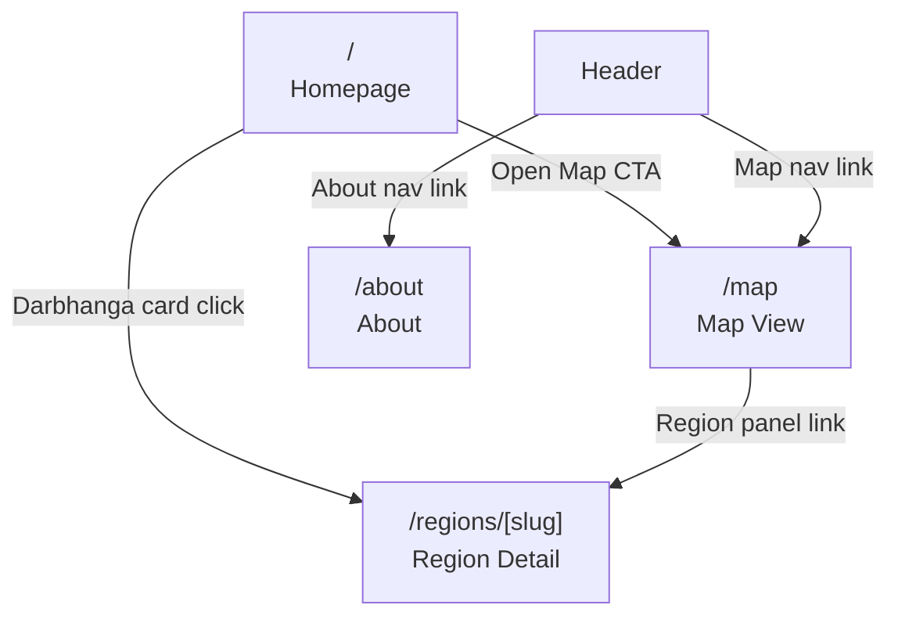

# Pages Spec

---

## Route Inventory

| Route / View      | File / Component              | Type             | Description          |
| ----------------- | ----------------------------- | ---------------- | -------------------- |
| `/`               | `src/App.jsx` + `src/components/*` | Immersive Canvas | Homepage / landing overlay (live globe background) |
| `/map`            | `src/components/map/MapCanvas.jsx` | Immersive Canvas | Full-screen dashboard overlay (shallow state transition) |
| `/about`          | `src/components/pages/About.jsx` | Static Page     | Vision & mission (content overlay) |
| `#/regions/:slug` | `src/data/regions.ts` + region components | Deep-linkable | Region detail view (URL hash or client routing) |

---

## Page 1: Homepage (`/`)

### Purpose

Introduce Better Bharat Map to first-time visitors. Communicate the mission, show a preview of what the platform does, and provide a clear CTA. The entire page sits on top of the live, interactive **3D Globe MapCanvas** (auto-spinning on load). 

### Layout & Immersion Mechanics

* **Ambient Mode (Zoom < 4)**: The map displays a beautiful dark or light custom 3D Globe projection, centered on India, rotating slowly.
* **Transition Trigger (Scroll/Zoom In/CTA Click)**:
  * Scrolling down or using trackpad zoom-in increases map zoom.
  * When `zoom >= 4`, the homepage copy, feature cards, and about sections fade smoothly to `opacity: 0`.
  * The top breadcrumb (`ZoomHierarchy`) and sidebar `LayerPanel` transition in smoothly (`opacity: 1`, `translate-x`).
  * The path changes seamlessly to `/map` without unmounting the canvas.

```
┌─────────────────────────────────────────────────────┐
│  Header: Logo + Nav (Map | About) + Theme toggle    │
├─────────────────────────────────────────────────────┤
│                                                     │
│  HERO OVERLAY (floating on glassmorphism card)      │
│  "Infrastructure Intelligence for a Better Bharat"  │
│  Subheadline + CTA → Zoom In / Explore Map          │
│                                                     │
│  [ LIVE 3D SPINNING EARTH GLOBE AS ACTIVE BG ]      │
│                                                     │
```
├─────────────────────────────────────────────────────┤
│  WHAT WE ANALYZE (8 category cards)                │
│  Flood | Roads | Healthcare | Agriculture           │
│  Railway | Electricity | Education | Safety         │
│                                                     │
├─────────────────────────────────────────────────────┤
│  HOW IT WORKS                                       │
│  3-step explainer: Data → Intelligence → Action     │
│                                                     │
├─────────────────────────────────────────────────────┤
│  PILOT REGION: DARBHANGA                            │
│  Map thumbnail + 7 blocks listed                   │
│                                                     │
├─────────────────────────────────────────────────────┤
│  DEVELOPMENT PHILOSOPHY                             │
│  Evidence-oriented, transparent, constructive       │
│                                                     │
├─────────────────────────────────────────────────────┤
│  Footer: Attribution + OSM credit + GitHub link     │
└─────────────────────────────────────────────────────┘
```

### Components Used

- `HeroSection` (custom)
- `CategoryCard` (8×, shadcn Card)
- `HowItWorksSteps` (custom 3-step)
- `PilotRegionPreview` (mini map + block list)
- `PhilosophyBanner`
- `SiteHeader`, `SiteFooter`

### SEO Metadata

```text
SEO metadata is managed via standard HTML `<head>` tags or helper utilities in the SPA (for example, `react-helmet`). Keep titles and meta descriptions in the root HTML or component-level head helpers.
```

---

## Page 2: Map View (`/map`)

### Purpose

The core mapping dashboard overlays. Since the `MapCanvas` is persistently mounted at the root layout level, navigating to `/map` seamlessly flies the camera to the active region (default: Darbhanga District, Zoom: 9) and slides in the dashboard control panel HUDs without a page refresh or map reload.

### Layout (Dashboard Mode active overlays)

```
┌─────────────────────────────────────────────────────┐
│  Header (compact, 48px, overlay on top)             │
├──────────┬──────────────────────────────────────────┤
│          │ ┌────────────────────────────────────┐   │
│  Layer   │ │  ZoomHierarchy Bar (top floating)  │   │
│  Panel   │ │  India > Bihar > Darbhanga > Block │   │
│  (320px) │ └────────────────────────────────────┘   │
│  HUD     │                                          │
│  Overlay │         [ PERSISTENT BACKGROUND MAP ]    │
│          │                                          │
│  ──────  │         (Popups appear here on click)    │
│          │                                          │
│  Intel   │                                          │
│  Panel   │    ┌──────────────────────────────────┐  │
│  HUD     │    │ Scale bar  Attribution  Controls │  │
│  Overlay │    └──────────────────────────────────┘  │
└──────────┴──────────────────────────────────────────┘
```

### Components

| Component           | Location                                  | Description                   |
| ------------------- | ----------------------------------------- | ----------------------------- |
| `MapCanvas`         | `components/map/MapCanvas.tsx`            | MapLibre mount                |
| `ZoomHierarchy`     | `components/map/ZoomHierarchy.tsx`        | Breadcrumb nav                |
| `LayerPanel`        | `components/panels/LayerPanel.tsx`        | Layer category tabs + toggles |
| `IntelligencePanel` | `components/panels/IntelligencePanel.tsx` | Scores for active region      |
| `FeaturePopup`      | `components/map/FeaturePopup.tsx`         | Click-to-detail popup         |
| `MapControls`       | `components/map/MapControls.tsx`          | Zoom, fullscreen              |
| `LayerCard`         | `components/map/LayerCard.tsx`            | Single layer toggle row       |
| `ScoreBadge`        | `components/ui/ScoreBadge.tsx`            | Color-coded score pill        |
| `ScoreBar`          | `components/ui/ScoreBar.tsx`              | Horizontal score bar          |

### State on This Page

```typescript
// URL-synced state (in hash)
{
  region: 'darbhanga:kusheshwar-asthan',
  layers: 'flood-risk,road-network',
  zoom: 12,
  center: '86.0978,26.2411',
}

// Local state (Zustand, not URL)
{
  panelOpen: true,
  activeCategory: 'flood',
  selectedFeature: Feature | null,
}
```

### Dynamic Import (critical)

```javascript
// In a Vite React SPA use `React.lazy` + `Suspense` or plain dynamic `import()`
import React, { lazy, Suspense } from 'react';

const MapCanvas = lazy(() => import('@/components/map/MapCanvas'));
const LayerPanel = lazy(() => import('@/components/panels/LayerPanel'));

// Usage example:
// <Suspense fallback={<MapSkeleton />}><MapCanvas /></Suspense>
```

---

## Page 3: About (`/about`)

### Purpose

Explain the vision, roadmap, data sources, and development philosophy.

### Sections

1. **Vision** — Earth-to-Village infrastructure intelligence
2. **Why It Exists** — The problem statement
3. **Roadmap** — Phases 1–10 visual timeline
4. **Data Sources** — OSM, Census, NHM, PMGSY
5. **Philosophy** — Evidence-oriented, constructive
6. **Contribute** — How to get involved (Phase 3+)

### Components

- `RoadmapTimeline` (custom vertical timeline)
- `DataSourceList` (shadcn Card per source)
- `PhilosophyPillars`

---

## Page 4: Region Detail (`/regions/[slug]`)

### Purpose

Dedicated page for a specific region (district/block) with full intelligence report.

### Region deep-links (static)

For the SPA we pre-bundle a `REGIONS` array (see `src/data/regions.ts`) and support deep-links via the URL hash or client-side routing. Pre-building a JSON `regions.json` at build time is also an option for tiny payloads.

Example: when the app loads, parse `location.hash` or `location.pathname` to hydrate the UI to the requested region and call `flyToRegion` with the region's data.

### Layout

```
┌─────────────────────────────────────────────────────┐
│  Header                                             │
├─────────────────────────────────────────────────────┤
│  Region Name + Level + Parent breadcrumb            │
│  Population | Area | Census Code                    │
├────────────────────────┬────────────────────────────┤
│                        │                            │
│  Mini Map              │  Score Dashboard           │
│  (MapCanvas, small)    │  (all 8 categories)        │
│  showing this region   │  with score bars           │
│                        │                            │
├────────────────────────┴────────────────────────────┤
│  Layer-by-layer intelligence detail                 │
│  (accordion per category)                           │
├─────────────────────────────────────────────────────┤
│  Child Regions (blocks/panchayats)                  │
│  Comparison table                                   │
└─────────────────────────────────────────────────────┘
```

---

## Shared Layout Components

### `SiteHeader`

```
Logo (Better Bharat Map)  |  Map  About  |  🌙 Theme
```

- Height: 48px
- Sticky on scroll
- Compact variant for map view (no extra nav space)

### `SiteFooter`

```
© 2024 Better Bharat Map
Data: © OpenStreetMap contributors | Government of India Open Data
Built with MapLibre GL JS | React + Vite | shadcn/ui
[GitHub] [About] [Data Sources]
```

---

## Navigation Structure


