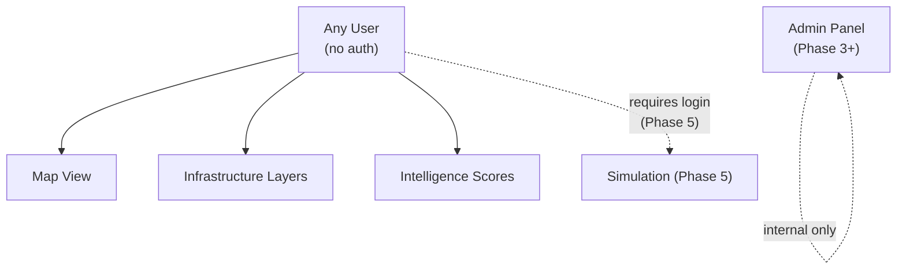

# Business Rules Spec

---

## Platform Purpose

Better Bharat Map is a **public infrastructure intelligence platform**. It is:

- Free to access, no authentication required (Phase 1–4)
- Evidence-based — no data without a citable source
- Non-partisan — presents facts, not opinions on governance
- Constructive — highlights both gaps and progress

---

## Data Governance Rules

### Rule 1: Source Attribution

Every infrastructure feature displayed on the map **must** have a traceable source.

```
RULE: infrastructure_features.source MUST NOT be NULL
RULE: infrastructure_features.source_date SHOULD NOT be older than 3 years for active features
RULE: If source_date is unknown, it MUST be explicitly marked as "date unknown" in UI
```

### Rule 2: Data Confidence Levels

Not all data has equal reliability. Confidence is derived from source:

| Source      | Confidence | Display                                      |
| ----------- | ---------- | -------------------------------------------- |
| `census`    | High       | Full opacity                                 |
| `ministry`  | High       | Full opacity                                 |
| `osm`       | Medium     | Full opacity if verified, 70% opacity if not |
| `satellite` | Medium     | Full opacity                                 |
| `survey`    | High       | Full opacity                                 |
| `manual`    | Low        | 60% opacity + disclaimer badge               |

### Rule 3: Verification Gate

```
RULE: Features with verified = false are displayed with a visual indicator
RULE: Unverified features are excluded from score computation
RULE: Score computation only uses verified = true features
```

### Rule 4: Score Computation

Infrastructure scores are **composite indices** — not raw counts.

Score = weighted average of normalized component metrics, clamped to [0, 100].

Each category has its own scoring algorithm (see `infrastructure-layers/LAYERS_SPEC.md`).

```
RULE: Scores are recomputed after every data import
RULE: Score history is not stored in Phase 1–3 (no time-series)
RULE: Score algorithm version is stored with each score record
RULE: If insufficient data exists for a region, score is NULL (not 0)
```

### Rule 5: Risk vs. Quality Score Convention

Two types of scores exist — the UI must clearly distinguish them:

| Type              | Meaning of 100  | Color for 100 | Example                                |
| ----------------- | --------------- | ------------- | -------------------------------------- |
| **Risk score**    | Maximum danger  | Red           | Flood risk: 100 = highest flood danger |
| **Quality score** | Maximum quality | Green         | Road quality: 100 = excellent roads    |

```
RULE: Layer metadata MUST declare score_type: 'risk' | 'quality'
RULE: UI renders risk scores with inverted color scale
```

---

## Access Model (Phase 1–4)

All data is publicly accessible. No user accounts.



### Phase 5+ Access Model

When simulation is introduced, basic auth is required:

| Role          | Capabilities                                       |
| ------------- | -------------------------------------------------- |
| `public`      | View all layers, scores, existing scenarios        |
| `contributor` | Create scenarios, submit data corrections          |
| `analyst`     | Export data, access raw scores, batch operations   |
| `admin`       | Manage data imports, verify features, manage users |

---

## Infrastructure Category Business Rules

### Flood Intelligence

```
RULE: Flood risk score considers historical frequency (>= 5-year data preferred)
RULE: A village is "seasonally isolated" if ALL road access points cross flood zones
RULE: Embankment condition must be verified annually — older data shown with warning
RULE: Flood zones are defined by return period: 5-year, 10-year, 25-year, 100-year
```

### Road & Connectivity

```
RULE: PMGSY (Pradhan Mantri Gram Sadak Yojana) roads are tracked separately
RULE: A village is "unconnected" if no paved road within 5km
RULE: Seasonal connectivity: road marked as seasonal if it's impassable for >30 days/year
RULE: Bridge-critical roads: roads where the only crossing is a bridge are flagged
```

### Healthcare

```
RULE: Accessibility radius thresholds:
  - Village level: PHC within 5km = accessible
  - Block level: District hospital within 20km = accessible
  - Emergency: Any facility with emergency within 10km = accessible
RULE: Non-functional facilities are excluded from accessibility scores
RULE: Ambulance coverage is tracked separately from facility proximity
```

### Agriculture

```
RULE: Irrigation access = % of cultivable land with documented irrigation source
RULE: Flood crop risk = overlap of agricultural land with 5-year flood zone
RULE: Makhana (water chestnut) regions are tracked as a Bihar-specific category
RULE: Storage infrastructure = cold storage or warehouse within 20km
```

### Electricity

```
RULE: Electrification = village with functional transformer and grid connection
RULE: Power stability is tracked separately (hours/day of reliable power)
RULE: Solar off-grid counted separately from grid electrification
RULE: Transformer risk assessed by age (>15 years = at-risk)
```

---

## Data Freshness Policy

| Data Type                 | Maximum Acceptable Age         | Action if Stale              |
| ------------------------- | ------------------------------ | ---------------------------- |
| Administrative boundaries | 5 years                        | Show warning                 |
| Road network              | 2 years                        | Show staleness indicator     |
| Healthcare facilities     | 1 year                         | Show warning + verify prompt |
| Flood zones               | 5 years (or latest event data) | Show warning                 |
| Population data           | 10 years (Census cycle)        | Note census year             |
| Electricity grid          | 2 years                        | Show warning                 |

---

## Display Rules

### Feature Popup Content

Every popup must show:

1. Feature name (English + Hindi if available)
2. Category icon
3. Key attributes (max 5)
4. Data source
5. Source date
6. Verified status

### Score Display

- Scores are shown as a number (0–100) + colored badge
- Score type (risk vs quality) is shown with a label
- If score is NULL: "Insufficient data" message, not 0
- Score components are expandable (accordion)

### Boundary Display Priority

At each zoom level, only show boundary level appropriate to zoom:

| Zoom  | Boundary Shown |
| ----- | -------------- |
| 1–3   | Country        |
| 4–5   | States         |
| 6–8   | Districts      |
| 9–11  | Blocks         |
| 12–13 | Panchayats     |
| 14+   | Villages       |
