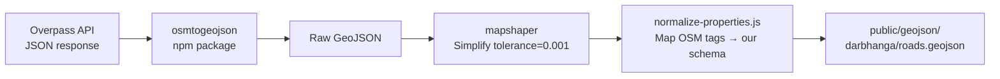

# External Services Spec

---

## Service Inventory

| Service                    | Purpose                 | Phase | Auth Required | Cost                |
| -------------------------- | ----------------------- | ----- | ------------- | ------------------- |
| OpenStreetMap Tiles        | Base map tiles          | 1+    | No            | Free (fair use)     |
| OSM Overpass API           | GeoJSON data extraction | 1–2   | No            | Free                |
| OSM Nominatim              | Geocoding (search)      | 2+    | No            | Free (rate limited) |
| Overture Maps              | Base geographic data    | 3+    | No            | Free (Apache 2.0)   |
| PMTiles (self-hosted)      | Vector tile serving     | 3+    | No            | Storage cost        |
| Martin Tile Server         | Vector tile server      | 3+    | Internal      | Self-hosted         |
| Mapbox (optional fallback) | Satellite imagery       | 3+    | API key       | Paid                |

---

## OpenStreetMap Tiles

### Usage

- **URL template**: `https://tile.openstreetmap.org/{z}/{x}/{y}.png`
- **Attribution required**: `© OpenStreetMap contributors`
- **Fair use policy**: Max 2 req/s per IP; no bulk downloading
- **Alternatives** (if OSM CDN is slow or down):

| Provider        | URL                                                                                              | Notes             |
| --------------- | ------------------------------------------------------------------------------------------------ | ----------------- |
| Carto Light     | `https://a.basemaps.cartocdn.com/light_all/{z}/{x}/{y}.png`                                      | Clean light style |
| Carto Dark      | `https://a.basemaps.cartocdn.com/dark_all/{z}/{x}/{y}.png`                                       | For dark mode     |
| Esri World Topo | `https://server.arcgisonline.com/ArcGIS/rest/services/World_Topo_Map/MapServer/tile/{z}/{y}/{x}` | Detailed terrain  |

### MapLibre Style Config

```typescript
// Phase 1: Use Carto (more reliable than OSM tile CDN for production)
export const MAP_STYLES = {
  light: {
    version: 8,
    sources: {
      "carto-light": {
        type: "raster",
        tiles: ["https://a.basemaps.cartocdn.com/light_all/{z}/{x}/{y}.png"],
        tileSize: 256,
        attribution: "© OpenStreetMap contributors © CARTO",
      },
    },
    layers: [
      {
        id: "carto-light-layer",
        type: "raster",
        source: "carto-light",
        minzoom: 0,
        maxzoom: 22,
      },
    ],
  },
  dark: {
    version: 8,
    sources: {
      "carto-dark": {
        type: "raster",
        tiles: ["https://a.basemaps.cartocdn.com/dark_all/{z}/{x}/{y}.png"],
        tileSize: 256,
        attribution: "© OpenStreetMap contributors © CARTO",
      },
    },
    layers: [
      {
        id: "carto-dark-layer",
        type: "raster",
        source: "carto-dark",
      },
    ],
  },
} satisfies Record<string, maplibregl.StyleSpecification>;
```

---

## OSM Overpass API

Used in Phase 1–2 data pipeline scripts to extract real GeoJSON from OSM.

### Endpoint

```
https://overpass-api.de/api/interpreter
```

### Rate Limits

- No hard limit but: use `[timeout:60]` in queries
- Avoid running during peak hours (UTC 12:00–22:00)
- Self-host Overpass for production data pipelines

### Query Examples

**Extract all roads in Darbhanga district:**

```overpassql
[out:json][timeout:60];
area["name"="Darbhanga"]["admin_level"="6"]->.district;
(
  way["highway"~"primary|secondary|tertiary|unclassified|residential|track"](area.district);
);
out body;
>;
out skel qt;
```

**Extract healthcare facilities:**

```overpassql
[out:json][timeout:60];
area["name"="Darbhanga"]["admin_level"="6"]->.district;
(
  node["amenity"~"hospital|clinic|health_centre|doctors"](area.district);
  way["amenity"~"hospital|clinic|health_centre"](area.district);
);
out center;
```

**Extract rivers and waterways:**

```overpassql
[out:json][timeout:60];
area["name"="Bihar"]["admin_level"="4"]->.state;
(
  way["waterway"~"river|canal|stream"](area.state);
  relation["waterway"="river"](area.state);
);
out body;
>;
out skel qt;
```

### Post-Processing Pipeline



**Script structure:**

```
scripts/
├── extract-osm.sh           # Overpass queries → raw JSON
├── convert-to-geojson.js    # osmtogeojson conversion
├── simplify.sh              # mapshaper simplification
├── normalize-roads.js       # road property normalization
├── normalize-healthcare.js  # healthcare property normalization
└── validate-geojson.js      # schema validation before output
```

---

## OSM Nominatim (Geocoding)

### Endpoint

```
https://nominatim.openstreetmap.org/search?q={query}&format=geojson&countrycodes=in&limit=5
```

### Rate Limit

- **1 req/s max** — do not parallelize
- User-Agent header required: `Better-Bharat-Map/1.0 (contact@betterbharat.in)`

### Response Contract

```json
{
  "type": "FeatureCollection",
  "features": [
    {
      "type": "Feature",
      "geometry": { "type": "Point", "coordinates": [85.8956, 26.1542] },
      "properties": {
        "display_name": "Darbhanga, Bihar, India",
        "place_id": 12345,
        "osm_type": "relation",
        "osm_id": 1234567,
        "addresstype": "district"
      }
    }
  ]
}
```

### Phase 1 Workaround (no Nominatim in static)

In static export, search is implemented as client-side filter over `REGIONS` constant — no API call needed for known regions. Nominatim is integrated in Phase 3 when API routes exist.

---

## Overture Maps (Phase 3+)

Overture Maps Foundation provides high-quality, open-licensed geographic data updated quarterly.

### Datasets of Interest

| Dataset          | Content                   | License             |
| ---------------- | ------------------------- | ------------------- |
| `admins`         | Administrative boundaries | CDLA Permissive 2.0 |
| `buildings`      | Building footprints       | CDLA Permissive 2.0 |
| `places`         | POIs (hospitals, schools) | CDLA Permissive 2.0 |
| `transportation` | Road network              | CDLA Permissive 2.0 |

### Access

```bash
# DuckDB + AWS S3 (no account needed for public data)
pip install duckdb

duckdb -c "
LOAD httpfs;
SELECT *
FROM read_parquet('s3://overturemaps-us-west-2/release/2024-09-18.0/theme=admins/type=administrativeBoundary/*', hive_partitioning=1)
WHERE bbox.xmin > 85.0 AND bbox.xmax < 87.0
  AND bbox.ymin > 25.5 AND bbox.ymax < 27.0
LIMIT 100;
"
```

---

## PMTiles (Phase 3+)

Self-hosted vector tiles stored as a single file per layer.

### Generation

```bash
# Install tippecanoe
brew install tippecanoe

# Generate PMTiles from GeoJSON
tippecanoe \
  --output=darbhanga-roads.pmtiles \
  --maximum-zoom=16 \
  --minimum-zoom=8 \
  --layer=roads \
  --attribute-type=road_class:string \
  public/geojson/darbhanga/roads.geojson
```

### MapLibre Integration

```typescript
import { Protocol } from "pmtiles";
import maplibregl from "maplibre-gl";

// Register pmtiles:// protocol (call once before map init)
const protocol = new Protocol();
maplibregl.addProtocol("pmtiles", protocol.tile.bind(protocol));

// Then use in map style sources:
map.addSource("roads", {
  type: "vector",
  url: "pmtiles://https://cdn.betterbharat.in/tiles/darbhanga-roads.pmtiles",
});
```

---

## Census of India Data

### Sources

| Dataset                          | URL                               | Format    |
| -------------------------------- | --------------------------------- | --------- |
| Primary Census Abstracts         | censusindia.gov.in                | Excel/PDF |
| Village-level data               | censusindia.gov.in/census.website | Excel     |
| LGD (Local Government Directory) | lgdirectory.gov.in                | Excel/API |

### LGD API (Phase 3+)

```
https://lgdirectory.gov.in/getLGDDetails.do
```

Provides standardized state/district/block/village codes linked to census data.

---

## Government Data APIs (Phase 3+)

| Ministry              | API/Portal                                | Data Available         |
| --------------------- | ----------------------------------------- | ---------------------- |
| MoRTH (Roads)         | data.gov.in                               | PMGSY road data        |
| MoHFW (Health)        | hmis.nhp.gov.in                           | PHC/hospital registry  |
| MoPower (Electricity) | vidyut.rajasthan.gov.in (varies by state) | Electrification status |
| Jal Shakti (Water)    | jaljeevanmission.gov.in                   | Water coverage         |
| Bihar DISCOM          | bsphcl.bih.nic.in                         | Power grid Bihar       |

### Integration Pattern (Phase 3)

```python
# All government APIs are consumed via scheduled ETL jobs
# Results stored in infrastructure_features with source='ministry'
# Never called at request time — always pre-processed
```
