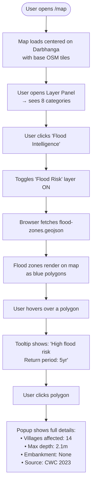
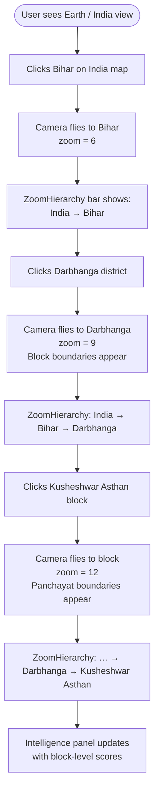
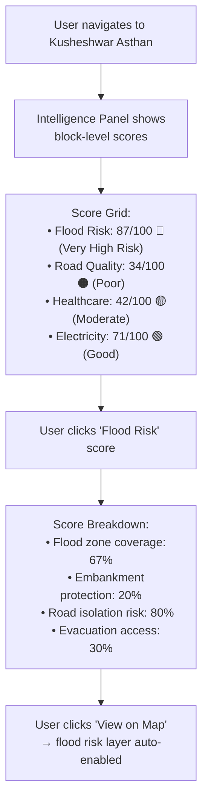
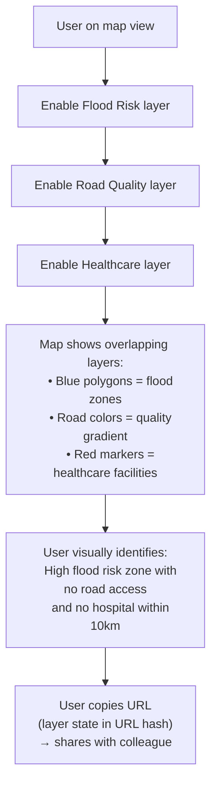
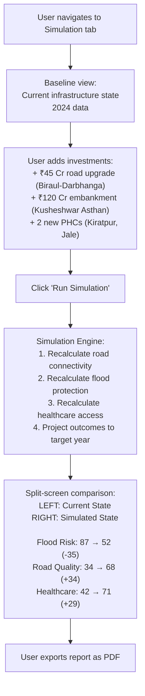

# Workflows Spec

---

## User Personas

| Persona        | Goal                                           | Technical Level |
| -------------- | ---------------------------------------------- | --------------- |
| **Researcher** | Analyze infrastructure gaps in Bihar           | High            |
| **NGO Worker** | Identify underserved villages for intervention | Medium          |
| **Planner**    | Compare development outcomes across blocks     | Medium          |
| **Journalist** | Visualize flood impact zones                   | Low             |
| **Citizen**    | Understand infrastructure in their area        | Low             |

---

## Core Workflows

### Workflow 1: Infrastructure Layer Exploration



---

### Workflow 2: Earth → Village Navigation



---

### Workflow 3: Intelligence Score Review



---

### Workflow 4: Multi-Layer Comparison



---

### Workflow 5: Simulation Scenario (Phase 5)



---

## URL State Management

Layer state and region state are encoded in the URL hash so views can be shared.

### URL Format

```
/map#region=darbhanga:kusheshwar-asthan&layers=flood-risk,road-quality&zoom=12&center=85.8956,26.1542
```

### URL Parameters

| Param      | Type                      | Example                              |
| ---------- | ------------------------- | ------------------------------------ |
| `region`   | `{district}:{block}`      | `darbhanga:kusheshwar-asthan`        |
| `layers`   | comma-separated layer IDs | `flood-risk,road-quality,healthcare` |
| `zoom`     | number                    | `12`                                 |
| `center`   | `{lon},{lat}`             | `85.8956,26.1542`                    |
| `scenario` | scenario UUID (Phase 5)   | `abc123`                             |

### Implementation

```typescript
// hooks/useUrlState.ts
import { useEffect } from "react";
import { useLayerStore } from "@/stores/layer";
import { useRegionStore } from "@/stores/region";
import { useMapStore } from "@/stores/map";

export function useUrlState() {
  // On mount: parse hash → hydrate stores
  // On store change: update hash
}
```

---

## Error States & Edge Cases

| Scenario               | Handling                                                                 |
| ---------------------- | ------------------------------------------------------------------------ |
| GeoJSON fetch fails    | Show toast "Layer data unavailable", keep layer toggle in error state    |
| No data for region     | Show "Insufficient data" in score panel, not 0                           |
| OSM tiles fail to load | Fallback to demotiles.maplibre.org                                       |
| Very slow connection   | Skeleton loading states in panel, progressive map tile loading           |
| Browser with no WebGL  | Show message: "Your browser doesn't support WebGL, required for the map" |
| GeoJSON malformed      | Catch parse error, log to console, show layer error state                |
